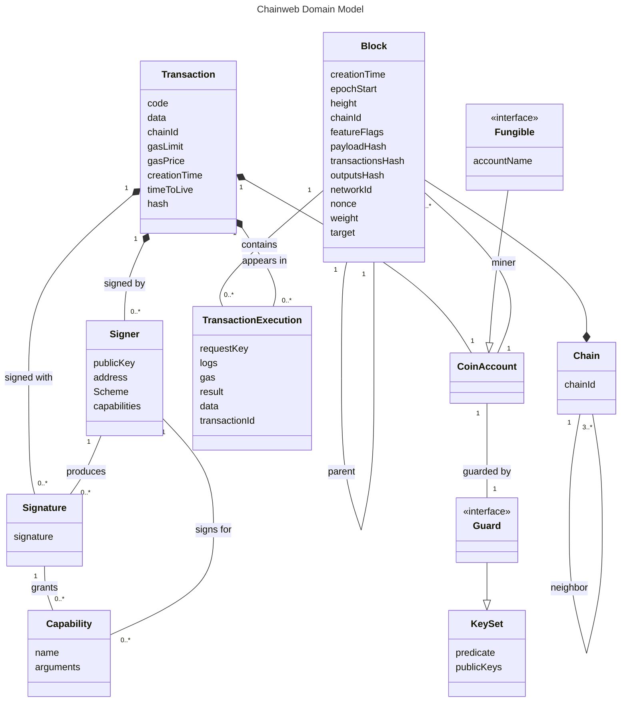

## Domain model

Explanation of the entities with their properties and the relations between them
([see also](https://www.ictdemy.com/software-design/uml/uml-domain-model)).  
The relations describe their cardinality and how they are related.

- `<>` open diamond: association, they can exist independently or relate to each
  other
- `<>` filled diamond: composition, the child cannot exist without the parent
- `|>` open arrow: generalization, the child is a specialization of the parent
- `--` line: association, the entities are related

Bike shedding:

- `sender` vs `gaspayer`
- `data` for transaction, what does it mean, adds scope
- use of the word `guard`
-

