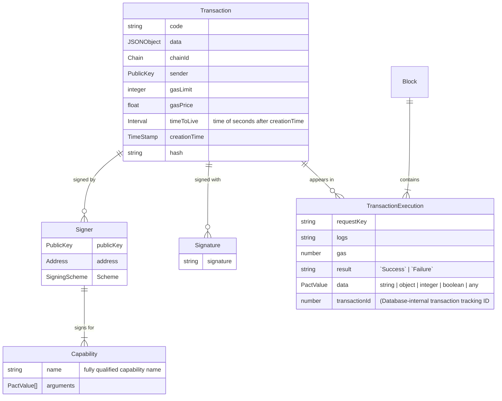

```mermaid

erDiagram
  Transaction ||--o{ Signer : "signed by"
  Transaction ||--o{ Signature : "signed with"
  Signer ||--|{ Capability : "signs for"
  Block  ||--|{ TransactionExecution : "contains"
  Transaction ||--o{ TransactionExecution : "appears in"

  Transaction {
    string code
    JSONObject data
    Chain chainId
    PublicKey sender 
    integer gasLimit
    float gasPrice
    Interval timeToLive "time of seconds after creationTime"
    TimeStamp creationTime
    string hash
  }

  Signer {
    PublicKey publicKey
    Address address
    SigningScheme Scheme
  }

  Signature {
    string signature
  }

  Capability {
    string name "fully qualified capability name"
    PactValue[] arguments
  }

  

  TransactionExecution {
    string requestKey
    string logs
    number gas
    string result  "`Success` | `Failure`"
    PactValue data "string | object | integer | boolean | any"
    number transactionId "(Database-internal transaction tracking ID"
  }


```
