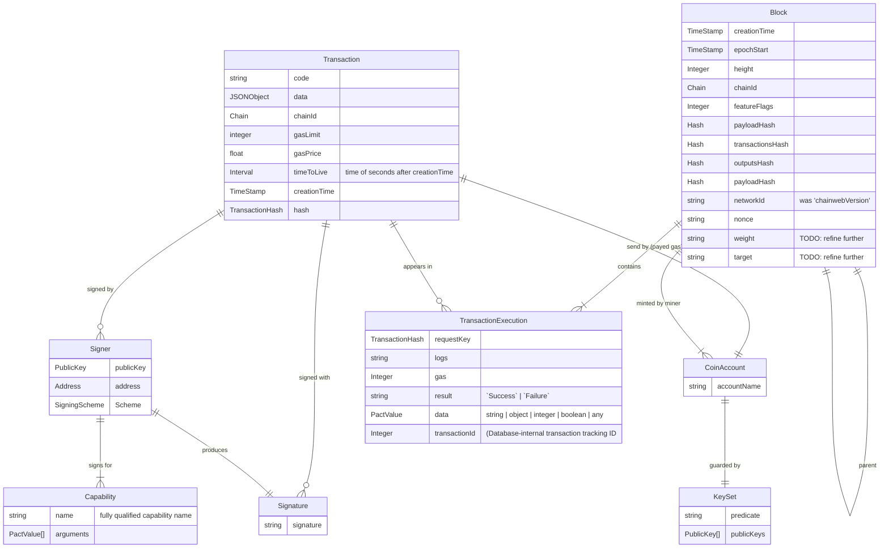

Domain model: conceptual model of the entities that exist. This doesn't
necessarily mean the interfaces will represent the entities in the same way

```mermaid

erDiagram
  Transaction ||--o{ Signer : "signed by"
  Transaction ||--o{ Signature : "signed with"
  Transaction ||--|| CoinAccount : "send by (payed gas)"
  Signer ||--|{ Capability : "signs for"
  Signer ||--|| Signature : "produces"
  Block  ||--|{ Block : "adjacent"
  Block  ||--|| Block : "parent"
  Block  ||--|{ TransactionExecution : "contains"
  Block  ||--|{ CoinAccount : "minted by miner"
  CoinAccount ||--|| KeySet : "guarded by"
  Transaction ||--o{ TransactionExecution : "appears in"

  Transaction {
    string code
    JSONObject data
    Chain chainId
    integer gasLimit
    float gasPrice
    Interval timeToLive "time of seconds after creationTime"
    TimeStamp creationTime
    TransactionHash hash
  }

  Signer {
    PublicKey publicKey
    Address address
    SigningScheme Scheme
  }

  Signature {
    string signature
  }

  Capability {
    string name "fully qualified capability name"
    PactValue[] arguments
  }

  TransactionExecution {
    TransactionHash requestKey
    string logs
    Integer gas
    string result  "`Success` | `Failure`"
    PactValue data "string | object | integer | boolean | any"
    Integer transactionId "(Database-internal transaction tracking ID"
  }

  Block {
    TimeStamp creationTime
    TimeStamp epochStart
    Integer height
    Chain chainId
    Integer featureFlags
    Hash payloadHash
    Hash transactionsHash
    Hash outputsHash
    Hash payloadHash
    string networkId "was 'chainwebVersion'"
    string nonce
    string weight "TODO: refine further"
    string target "TODO: refine further"
  }

  CoinAccount {
    string accountName
  }

  KeySet {
    string predicate
    PublicKey[] publicKeys
  }
```
