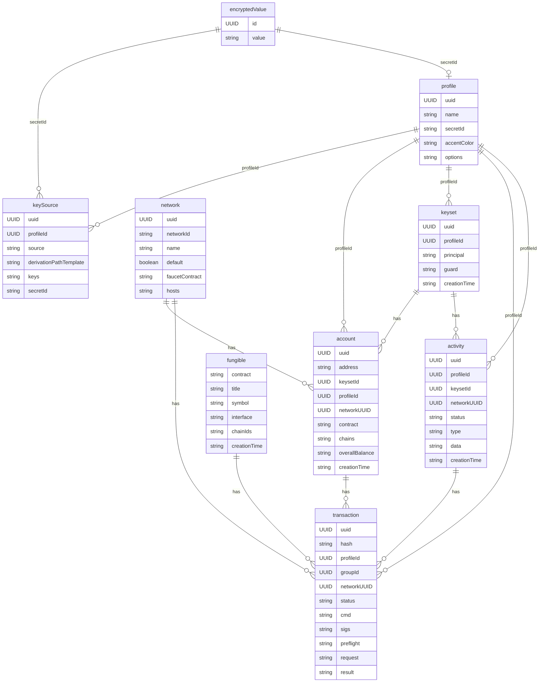

# Contributing

## Architecture

IndexedDB is used to store the data.  
There are **repositories** to access the data  
There are **services** to interact with the repositories  
The repositories and services are bundled into **modules**

### Modules

We have the following modules:

- `account` - for account management
- `activity` - for activity management like transfers, draft transfers, signing
  requests
- `key-source` - for key management
- `network` - for network management like mainnet01, testnet04, custom networks
- `transaction` - for transaction management
- `wallet` - for key-derivation management

### Sensitive values

Any value that is sensitive is stored in the `encryptedValue` table. The value
can be linked throuhg the `UUID` which is stored in the `secretId` property of
the related entity.

### ERD

In the dev-wallet we're using IndexedDB to store the data. The following is the
ERD for the database.

