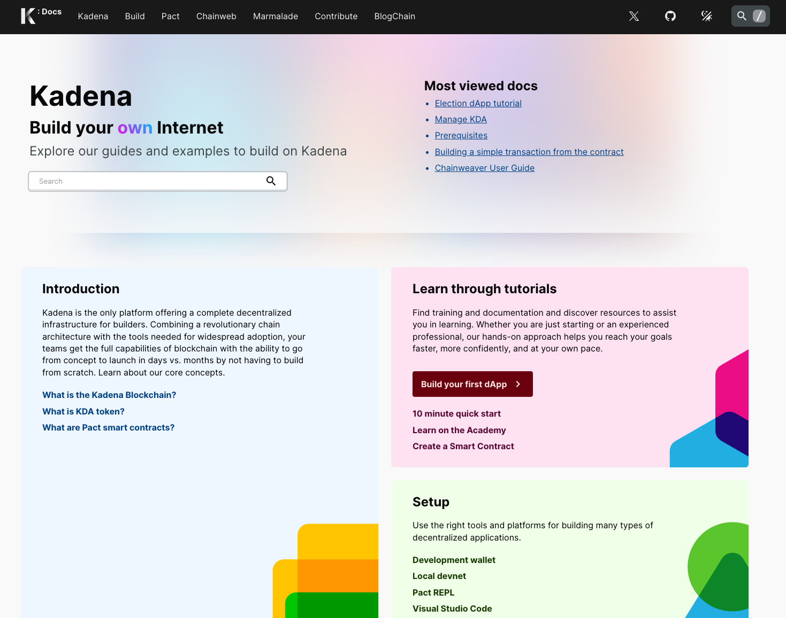
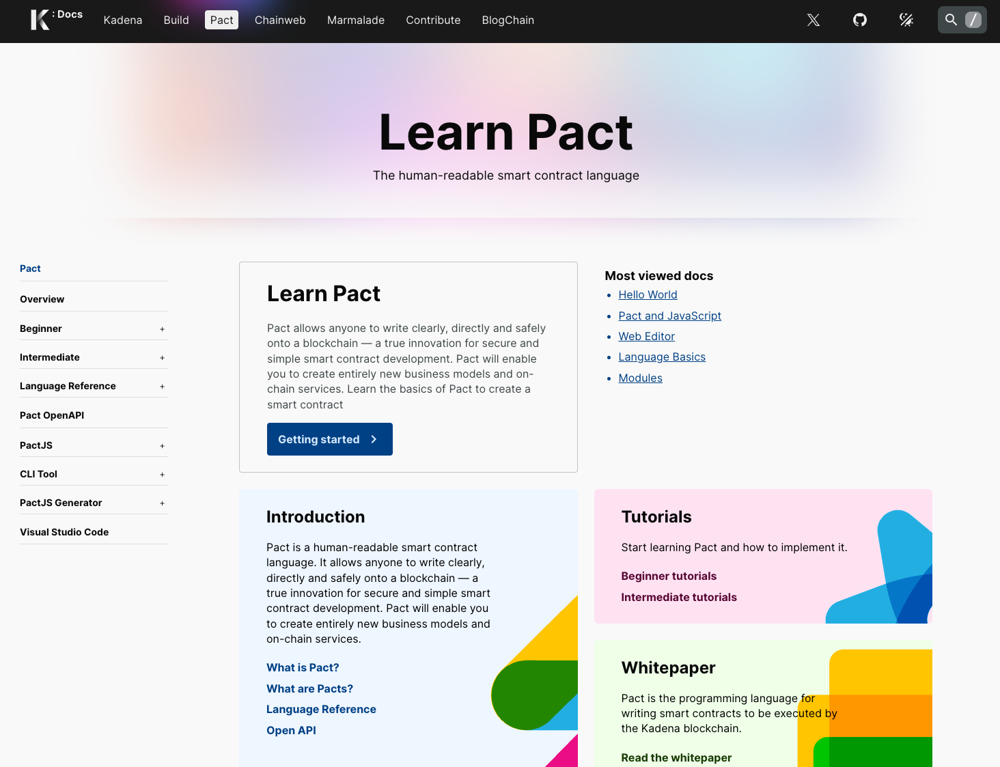
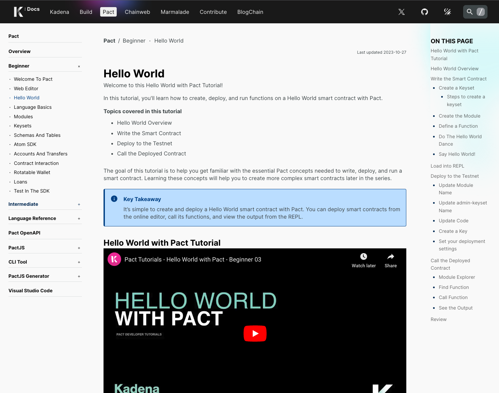
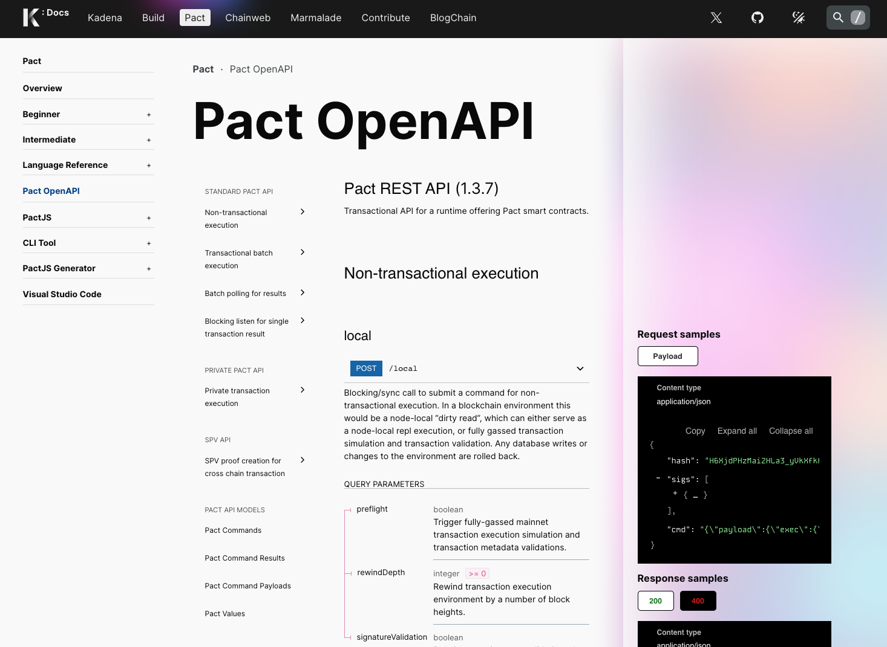
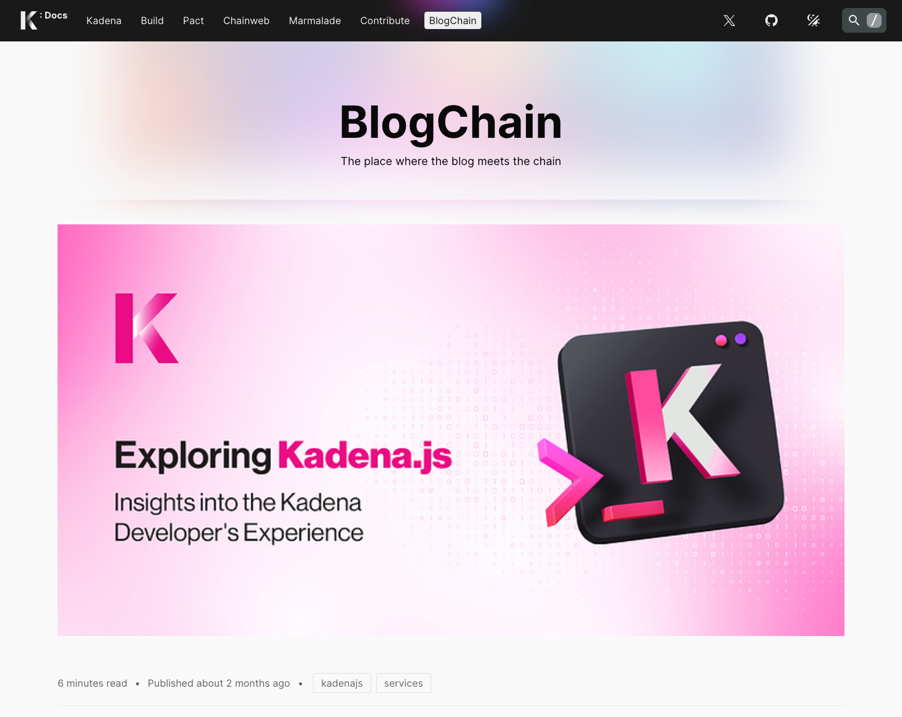

We encourage everyone with an interest in improving Kadena documentation to contribute content, submit issues, and suggest changes.
This guide describes how you can make changes to the documentation website directly by editing source files or indirectly by requesting updates.
You can follow these instructions whether you are an internal or external contributor.

## Before you begin

To follow the steps in this guide, verify the following basic requirements:

- You have a code editor, a GitHub account, and experience using command-line programs, including `git` commands and command line options.
- You are familiar with using Markdown to add formatting elements to plain text documents. 
  For information about using Markdown, see the [Markdown Guide](https://www.markdownguide.org/).

- You have the `pnpm` package manager installed.
  
  Depending on your development environment, you can install `pnpm` using a standalone script or using a package manager.
  For example, you can run the command `brew install pnpm` or `npm install --global pnpm` to install `pnpm` on your local computer.
  For more information about installing `pnpm` on different operating systems, see [Installation](https://pnpm.io/installation).
  
  Run `pnpm --version` to verify that you have `pnpm` installed and the version you are running. 

- You have run `pnpm setup` to add pnpm to your PATH environment variable and updated your terminal to use the new PATH.

## Set up a local development environment

To set up a local development environment for contributing to Kadena documentation:

1. Open a terminal shell on your computer.

1. Clone the `kadena-js` repository by running the following command:

   ```code
   git clone https://github.com/kadena-community/kadena.js.git
   ```

   This command clones the entire public repository for the TypeScript and JavaScript tools that enable you to interact with the Kadena ecosystem, including the documentation engine and user interface components.

2. Change to the root of the `kadena-js` repository by running the following command:
   
   ```code
   cd kadena.js
   ```

3. Install the workspace dependencies by running the following command:

   ```code
   pnpm install
   ```

   This command installs all of the workspace dependencies used to build the documentation as a web application, including shared user interface components.


4. Install the `turbo` virtualization software by running the following command:
   
   ```
   pnpm install --global turbo
   ```

   After you run this command, your local workspace has everything you need to build the documentation locally.

5. Change to the root of the `docs` application directory by running the following command:
   
   ```code
   cd kadena.js/packages/apps/docs
   ```
   
   If you explore the contents of the `docs` directory, you'll see the files and subfolders used to build the documentation as a web application.
   To contribute to documentation, you typically only need to work in the `/src/pages` folder and its subfolders and individual pages.
   The `/src/pages` folder includes files and subfolders that define the structure of the content and the operation of the application.
   For example:

   - `/api` contains scripts to interact with the website using REST API calls.
   - `/authors` contains scripts to capture blog post authors.
   - `/blogchain` maintains the archive of blog post articles.
   - `/build` contains sub-folders and Markdown files with information for builders.
   - `/chainweb` contains a script to include Chainweb documentation that is generated automatically in the website.
   - `/contribute` contains documentation related to community activities.
   - `/help` contains a placeholder for displaying help topics.
   - `/kadena` contains sub-folders and Markdown files with information about Kadena, including core concepts and terminology.
   - `/marmalade` contains sub-folders and Markdown files with information about Marmalade, including architecture and metadata.
   - `/pact` contains sub-folders and Markdown files with information about the PACT language, including tutorials, examples, and reference.
   - `/search` contains the script used to search for information in the application.
   - `/tags` contains scripts to capture blog post tags.
   
   Within these folders, the Markdown files—files with the `md` or `mdx` extension—contain the documentation content.
   After you explore these folders, create a local working branch of the repository for your contribution.

6. Create a local branch with a prefix that identifies you as the author and a branch name that describes the content you intend to add or change.
   For example, if your git handle is `lola-pistola` and you are fixing a typo in the kadena folder, you might create a branch like this:

   ```code
   git switch -c lola-pistola/typo-kadena-kda-concepts
   ```
   
## Start a local development server

As you make changes to the content in your local branch, it's helpful to see how the changes will be 
rendered when the documentation is published.

You can use `pnpm dev` to run a local development server that detects changes to the documentation and displays them automatically in the browser.

To start the development server in your local environment:

1. Open a terminal shell and switch to your working branch, if necessary.
   For example:
   
   ```code
   git switch lola-pistola/typo-kadena-kda-concepts
   ```

1. Build the docs application by running the following command:
   
   ```
   turbo run build --filter @kadena/docs^...
   ```

2. Change to the `docs` application directory by running the following command:
   
   ```code
   cd kadena.js/packages/apps/docs
   ```
   
3. Start the development server by running the following command:
   
   ```code
   pnpm dev
   ```

   This step imports files from multiple locations and can take some time to complete.

4. Open a web browser and navigate to the documentation using the URL `localhost:3000`. 
   
   This step compiles the application and displays the top-level landing page.

## Structure content using folders and pages

The top-level landing page—including the text and curated links—is defined in the file `packages/apps/docs/src/pages/index.tsx`.
Currently, the top navigation header has the following top-level sections:

- Kadena
- Build
- Pact
- Chainweb
- Marmalade
- Contribute
- BlogChain

These top navigation links correspond to folders in the `src/pages` folder. 
The landing page for each section also contains hard-coded text in the index.tsx file for that section.
For example, the Build section landing page is `packages/apps/docs/src/pages/build/index.tsx`.
Subsections within each top-level folder are grouped into folders and each folder has an `index.md` file for its first page of content.

You can add pages to the existing structure to add a topic to the current information architecture.
The navigational structure can be up to three levels deep.
For example:

- Top level (1) folder: Build
- Second level (2) folder: Cookbooks
- Third level (3) page: index.md

### Naming pages

If you create a new `.md` file, use the intended topic title as the name of the file.
The name you specify defines the UR, so it should be descriptive but not too long. 
Replace spaces between words with a hyphen (-). 
For example, use files names that look like this:

- `create-a-new-application.md`
- `new-version-pact.mdx`

Not file names that look like this:

- `newDOCSApplication.md`
- `new_pact_version.ts`
- `language reference.tsx`

### Specifying frontmatter

Every Markdown file includes a **frontmatter** section with some metadata about the document. 
The frontmatter is always defined at the start of the file before any of the topic content.
For the docs web application, the frontmatter looks something like this:

```yaml
---
title: Short topic title
subTitle: It's new!
description: Provides a brief description of the content of this page.
menu: Nav section
label: Nav title
editLink: https://github.com/kadena-community/kadena.js/edit/main/packages/tools/cookbook/README.md
publishDate: 1977-10-13
headerImage: /assets/blog/2020/1_b97oiC8M_ePx83B-PW0Cfg.webp
author: Author name
authorId: AuthorID
layout: Layout type
---
```

| Keyword | Description
| ------- | -----------
| `title` | Specifies the user-face title of the topic. It should match the file name.
| `subTitle`| Specifies a subtitle for the topic. It's only used in the landing page layout.
| `description`| Specifies a short description on what the page is about. This information is used as metadata for SEO and can  be used as an excerpt in the search results.
| `menu` | Specifies the name used in the side or header menus.
| `label` | Specifies the name used in the breadcrumbs.
| `editLink` | Specifies the location of the content for the page. In this example, the content has been imported from somewhere else. The `editlink` is used at the bottom of almost every page to show a link for editing to everyone who visits the page to enable content changes from external contributors. The `editLink` is added to the frontmatter at runtime or when doc is imported from outside the package.
| `publishDate` | Specifies the date an article was first published. It's only used for BlogChain articles.
| `headerImage` | Specifies an image to use at the top of an article. It's only used for the BlogChain main header.
| `author` | Deprecated. 
| `authorID` | Replaces the `author` field for BlogChain articles using the information from the `./src/data/authors.json` file.
| `layout` | Checks what layout the page will use to show the data.
| `tags` | Specifies an array of strings to clarify what the content is about. It's used for BlogChain articles and in the search indexing
to get better search results.

### Adding images

You can add images—like diagrams and screenshots—in the following folder `/public/assets`.
You can make as many subfolders as you see fit.

### Selecting a layout

Pages can use different layouts to address different content requirements:

| Layout keyword | Description
| -------------- | -----------
| `home` | Use the `home` layout for top-level landing pages with multiple sections and the site home page.
| `landing` | Use the `landing` layout for section introductions that require more navigation and less content.
| `full` | Use the `full` layout with the left and right side menus for the most content pages. 
| `redocly` | Use the `redocly` layout for generated swagger API output.
| `blog` | Use the `blog` layout for blog post articles.

#### Home layout example

The `home` layout use TypeScript and React instead of Markdown. 
The text displayed is hardcoded. 
The header and layout are customized for the page.

 

#### Landing layout example

Section-level `landing` pages are similar to the `home` page.
They can provide a visual entry point to a large content set.
The layout uses the `title` and `subTitle` from the frontmatter.



#### Full layout example

Most content pages use this layout with left peer and child navigation and a _On this page_ content on the right.

 

#### Redocly layout example

The `redocly` layout should only be used for swagger API pages.

 

#### Blog layout example

The `blog` layout should only be used for blog post articles. 
It shows the large `headerImage` from the frontmatter, if available.
It also shows the `author` and `tags` from the frontmatter, if available.



## Renaming and moving pages

Moving a page to another place in the tree is as simple as moving a file somewhere inside the `src/pages` directory.
When the build runs, the page is automatically is put in the correct position.
However, keep in mind that renaming a file changes its URL and can have the following consequences:

- Internal links might be broken. You will get a warning
  from the build scripts.
- External pages or websites linking to the page might return 404 errors.

Before renaming a file, check Google analytics to see how frequently the page is visited.
If the page gets a lot of views or visitors, define a 301 redirect in the `next.confing.mjs` file to redirect from the old URL to the new URL.

## Importing content from external sources

Most of the documentation files live in the `docs` package and can be edited directly in place. 
However, some documentation files live outside of the `docs` package and are maintained in other packages or repositories. 
Build scripts import and copy external documentation files into their correct position during the build.
After you run the build script once, the imported files are visible in the `src/pages` subfolder.
If you make changes in these files locally, your changes are overwritten the next time you run a build.

If a file has the `editLink` frontmatter property, go to the location specified by this property to edit the file.

### Multi-page import

Some imported files are just too big to display as a single page. 
These files are automatically broken up into multiple pages during the import process by checking the `h2` headings. 
For these files, every `h2` heading is the start of a new page.
The `editLink` frontmatter prop is the same for all these pages.

## Checking documentation validity

If you want to check that all the files are valid and ready to build without run the complete build, run the following command:

```bash
pnpm build:scripts
```

## Build scripts

To help a build run smoothly by importing files and identifying issues like broken links or errors in Markdown, the following build scripts run before the site goes live: 

- `importAllReadmes.mjs` imports documentation from other packages in the current repo.
- `createDocsTree.mjs` create a large `json` file with the complete menu structure of the whole application, together with some extra metadata. This file is used for navigational features such as finding the next and previous pages for navigation.
- `createSpecs.mjs` creates the `json` files for the swagger-like pages for Pact and Chainweb API documentation.
- `detectBrokenLinks.mjs` checks all of the internal documentation links to verify that they are pointing to a file and prevent 404 errors.
  This script also checks for domains that aren't used anymore, such as `pact-language.readthedocs.io` and `medium.com/kadena-io`.
  The script renames some links from https://docs.kadena.io to internal links.
- `checkForHeaders.mjs` checks that every page uses at least an h1 header at the top of the page. Important for SEO.
- `checkAuthors.mjs` checks that blog posts have valid author information.
- `createSitemap.mjs` creates a sitemap of all the pages and creates a `sitemap.xml`.
  This file is later imported by search engines to know what is needed to be crawled. Important for SEO.
- `copyFavIcons.mjs` copies all the favicons from the `/common/images/icons` package in the monorepo.

## Adding issues

If you find issues with the documentation content or format or have suggestions for improvement, submit an [issue](https://github.com/kadena-community/kadena.js/issues).

## Cli

The CLI is a TODO.

- bootstrap a page
- run build scripts more fine-grained (only the import scripts for example)
- can we do something like 'docs-prettier'?
