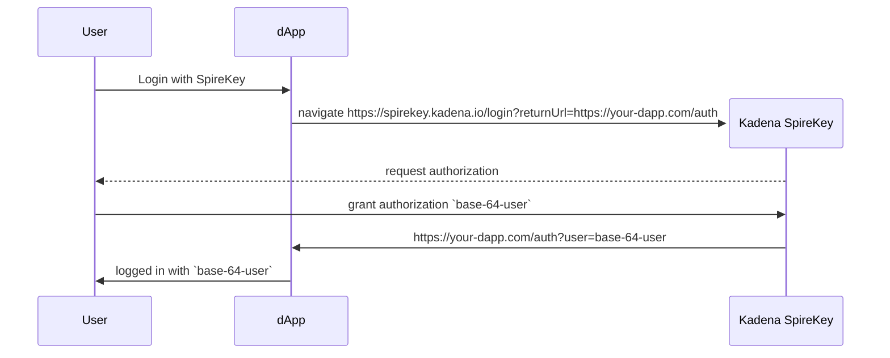
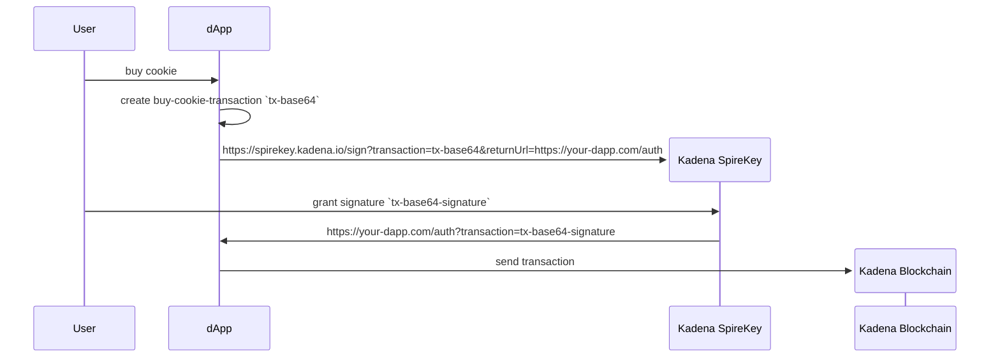

# Authenticate and authorize with Kadena SpireKey

Kadena SpireKey is an innovative approach to authenticating users and
authorizing transactions in Web3 and decentralized applications. Kadena SpireKey
leverages the OAuth protocol and the Web Authentication (WebAuthn) API to
provide a secure backend that simplifies the end user experience. With Kadena
SpireKey, users can connect to a wallet and sign transactions using methods that
feel familiar to them. For example, an application might present a QR code for
them to scan to approve a transaction or send a link to a device that enables
them to authenticate using facial recognition or a fingerprint.

By integrating Kadena SpireKey with your applications, you can allow your users
to authenticate and sign transactions without using passwords or managing public
and private keys and by using any method that supports passkeys, including Apple
ID, Google Accounts, or hardware security keys.

If you're building decentralized applications, implementing Kadena SpireKey can
help bring down the barriers to adoption by providing a more secure
authentication and authorization process with fewer steps and a more familiar
flow.

By making transactions easier and more secure, Kadena SpireKey can improve how
people interact with digital services and make Web3 more accessible and
practical for everyday use.

As an introduction to Kadena SpireKey, this guide explains how you can do the
following:

- Connect your application to a Kadena SpireKey wallet.
- Retrieve the available account for a user.
- Sign a transaction with a Kadena SpireKey signature.

## How Kadena SpireKey works

Before you add Kadena SpireKey authentication and authorization services to your
applications you should be familiar with the basics of how it works and the
underlying technology that it relies on.

At its core, Kadena SpireKey is inspired by the [OAuth](https://oauth.net/2/)
protocol. The OAuth protocol is an open industry standard for designing
authentication and authorization work flows. The OAuth standard is what enables
users to authenticate using identity providers like Google, Facebook, GitHub,
and others.

If you're familiar with the OAuth 2.0 protocol, you know that it defines four
roles:

- The **resource owner** is responsible for granting access to a requested
  resource.
- The **resource server** is responsible for accepting and responding to
  resource requests using **access tokens**.
- The **client** is any application making a resource requests on behalf of the
  resource owner and with its authorization.
- The **authorization server** is responsible for issuing access tokens to the
  client after authenticating the resource owner and obtaining authorization.

The following diagram provides a simplified overview of the workflow between
these roles.


The workflow for Kadena SpireKey is similar. In Kadena SpireKey, your
decentralized application is the client application hosted on the resource
server, for example, on the Kadena public network. To work with your
application, users register on the network using Kadena SpireKey. Kadena
SpireKey then acts as the authorization server and uses WebAuthn to grant access
tokens. After users are authenticated by WebAuthn, your application can use the
account information to construct transactions. The transactions passed back to
users are signed by Kadena SpireKey using whatever method you choose to
implement in your application.

With this overview in mind, let's look at how you can integrate Kadena SpireKey
with your application.

## Integrate with Kadena SpireKey

There are three basic integration points between a decentralized application and
Kadena SpireKey. To integrate with Kadena SpireKey, your application needs to
enable users to perform the following steps:

- Register an account on Kadena SpireKey by authenticating in Kadena SpireKey
  using a Web Authentication (WebAuthn) method.
- Log in using a Kadena SpireKey account.
- Sign transactions created by the application using a Kadena SpireKey account.

### Register an account in Kadena SpireKey

The following diagram illustrates the process for registering an account using
Kadena SpireKey.


### Log in with Kadena SpireKey

The following diagram illustrates the process for logging in with a Kadena
SpireKey account.



### Sign a transaction from the application

The following diagram illustrates the process for signing a transaction using a
Kadena SpireKey account.



## Authentication request and response

To authenticate users for your application, your application must send a GET
request to the Kadena SpireKey `login` endpoint and receive a response.

### Authentication request

Send a GET request to Kadena SpireKey using the HTTPS protocol.

```
https://spirekey.kadena.io/login?returnUrl=https://your-dapp.com/auth
```

- host `https://spirekey.kadena.io`
- path `/login`
- query-string parameters
  - `returnUrl`: `string` - the url where the user will be redirected to after
    authentication.
  - `optimistic`: `boolean` - when `true`, Kadena SpireKey will return a signed
    transaction, even when there are pending transactions. The response will
    include `pendingTxIds`.

### Authentication response

Your application receives a response with the following payload:

```
https://your-dapp.com/auth?user=base-64-user
```

- `user`: `base64<JSON>` - base-64 JSON object, from `user` query-string
  parameter
  - `credentials`: `Array<object>`
    - `publicKey`: `string` - The public-key associated with the account
    - `type`: `string` - type of the credential, can be `WebAuthn`
    - `id`: `string` (optional) - The WebAuthn Credential ID. Omitted when
      `type=ED25519`
  - `accountName`: `string` - the c-account of the user
  - `alias`: `string` - Alias the user provided when creating the account in
    Kadena SpireKey
  - `pendingTxIds`: `Array<string>` - List of transaction Request Keys. One of:
    - Account Creation Transaction id: the account is being minted, and the dapp
      can use this to verify when this is completed. The `user` object, can
      already be used to prepare transactions for the user.

## Sign request and response

To sign transactions for your application, your application must send the
transaction to the Kadena SpireKey endpoint and receive a response.

### Sign request

Send a request to the Kadena SpireKey `sign` endpoint using the following
format:

```
https://spirekey.kadena.io/sign?transaction=tx-base64&returnUrl=https://your-dapp.com/auth
```

- host `https://spirekey.kadena.io`
- path `/sign`
- query-string parameters
  - `transaction`: [`IUnsignedCommand`]() a base64 encoded transaction
  - `returnUrl` the url where the user will be redirected to after signing
  - `optimistic`: `boolean` - when `true`, Kadena SpireKey will return a signed
    transaction, even when there are pending transactions. The response will
    include `pendingTxIds`.

### Sign response

Your application receives a response with the following payload:

```
https://your-dapp.com/auth?transaction=base-64-signed-transaction
```

- host `https://your-dapp.com`
- path `/auth`
- query-string parameters:
  - `transaction`: `base64<IUnsignedCommand>` - base-64 JSON object
  - `pendingTxIds`: `base64<Array<string>>` - List of pending transaction
    Request Keys. The app needs to await them before submitting the returned
    transaction
