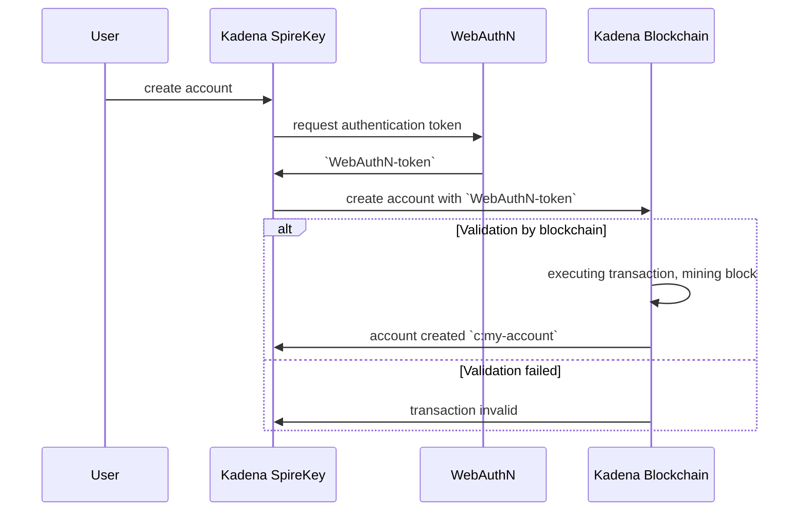
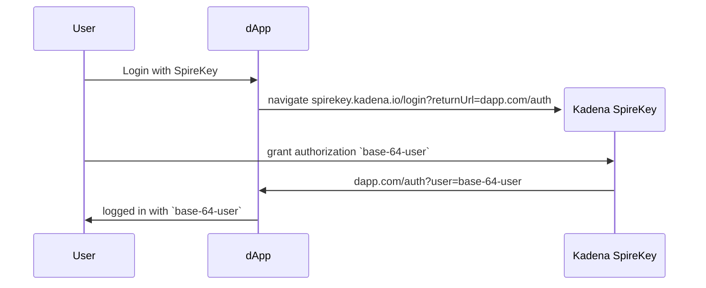
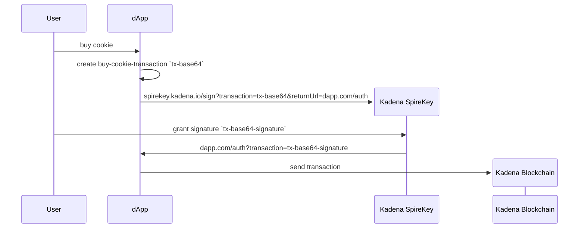

# Kadena SpireKey User Guide

---

- [Kadena SpireKey User Guide](#kadena-spirekey-user-guide)
  - [Short Introduction](#short-introduction)
  - [Conceptual Overview](#conceptual-overview)
    - [Create account in Kadena SpireKey](#create-account-in-kadena-spirekey)
    - [Login with Kadena SpireKey](#login-with-kadena-spirekey)
    - [Sign Transaction from dApp](#sign-transaction-from-dapp)
  - [Specification](#specification)
    - [OAuth authenticate](#oauth-authenticate)
      - [Authentication request](#authentication-request)
      - [Authentication Response](#authentication-response)
    - [Kadena SpireKey Sign](#kadena-spirekey-sign)
      - [Sign Request](#sign-request)
      - [Sign Response](#sign-response)

## Short Introduction

In this document you will learn how to **connect** your dApp to Kadena SpireKey,
**retrieve the available accounts** and sign with WebAuthN via the Kadena
SpireKey Wallet

## Conceptual Overview

From a dApp we want to access the accounts that are available on the Kadena
SpireKey Wallet. With this information, we can then construct transactions.
These transactions need to be signed by Kadena SpireKey

We're all familiar with OAuth. OAuth enables the user to authenticate with a
third-party authentication provider like Google, Facebook, Github and many more.


The similarities are:

- the **dApp** is the **Client Appliaction**
- **Kadena SpireKey** works as a delegate for **Authorization Server** and in
  turn acesses **WebAuthN** to grant access
- and the **dApp** is hosted by the **Resource Server**

Let's take a look in how the flow would be for a **dApp** and **Kadena
Spirekey**

1. The user creates an account on Kadena SpireKey by authenticating with
   WebAuthN
2. The user login with Kadena SpireKey from the dApp
3. The user wants to sign a transaction created by the dApp

### Create account in Kadena SpireKey



### Login with Kadena SpireKey



### Sign Transaction from dApp



## Specification

### OAuth authenticate

#### Authentication request

A GET request needs to be send to Kadena SpireKey

```
spirekey.kadena.io/login?returnUrl=dapp.com/auth
```

- host `spirekey.kadena.io`
- path `/login`
- querystring parameters
  - `returnUrl` the url where the user will be redirected to after
    authentication.

#### Authentication Response

```
yourdapp.com/auth?user=base-64-user
```

- `user`: `base64<JSON>` - base-64 JSON object, from `user` querystring
  parameter
  - `credentials`: `Array<object>`
    - `publicKey`: `string` - The public-key associated with the account
    - `type`: `string` - type of the credential, can be `WebAuthN`
    - `id`: `string` (optional) - The WebAuthN Credential ID. Omitted when
      `type=ED25519`
  - `accountName`: `string` - the c-account of the user
  - `name`: `string` - Alias the user provided when creating the account in
    Kadena SpireKey
  - `pendingTxIds`: `Array<string>` - List of transaction Request Keys. One of:
    - Account Creation Transaction id: the account is being minted, and the dapp
      can use this to verify when this is completed.  
      The `user` object, can already be used to prepare transactions for the
      user.

### Kadena SpireKey Sign

#### Sign Request

```
spirekey.kadena.io/sign?transaction=tx-base64&returnUrl=dapp.com/auth
```

- host `spirekey.kadena.io`
- path `/sign`
- querystring parameters
  - `transaction`: [`IUnsignedCommand`]() a base64 encoded transaction
  - `returnUrl` the url where the user will be redirected to after signing
  - `optimistic`: `boolean` - when `true`, Kadena SpireKey will return a signed
    transaction, even when there are pending transactions.  
    The response will include `pendingTxIds`.

#### Sign Response

```
yourdapp.com/auth?transaction=base-64-signed-transaction
```

- host `yourdapp.com`
- path `/auth`
- querystring parameters:
  - `transaction`: `base64<IUnsignedCommand>` - base-64 JSON object
  - `pendingTxIds`: `base64<Array<string>>` - List of pending transaction
    Request Keys. The app needs to await them before submitting the returned
    transaction
